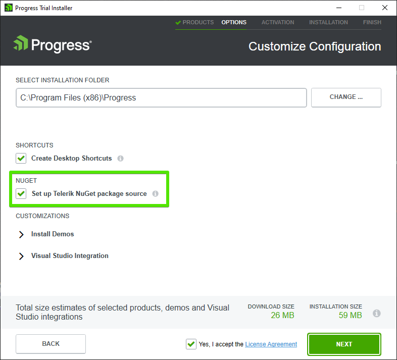

# Installation Overview

This article describes how to download and install Telerik UI for ASP.NET Core on a Windows machine.

## Prerequisites

* Telerik UI for ASP.NET Core requires .NET Core. To install .NET core, follow the instructions on [Microsoft's .NET Core documentation site](https://docs.microsoft.com/en-us/dotnet/core/windows-prerequisites).

* The Telerik UI for ASP.NET Core **Sample Application** distributed with the same package requires:

  * [.NET Core](https://dotnet.microsoft.com/learn/dotnet/hello-world-tutorial/install)
  * [Visual Studio](https://www.visualstudio.com/downloads/) with completely installed `.NET Core cross-platform development` workload. See the Supported [Visual Studio Versions]().

## Download

To download Telerik UI for ASP.NET Core:

1. Log into your [Telerik account](https://www.telerik.com/login/).
1. Click **Downloads** in the top navigation bar.
1. Click **Progress® Telerik® UI for ASP.NET Core**.
1. In the **Installation**  section, select the `msi` installer file.

>**Tip**
>
> If you don't want to install UI for ASP.NET Core on your machine, you can include Telerik UI controls in your project via NuGet. See [Installing with NuGet]() for more information.

## Installation

Run the Telerik UI for ASP.NET Core installer. The automatic setup will guide you through the rest of the installation. The default installation directory is `C:\Program Files (x86)\Progress\Telerik UI for ASP.NET Core <version>`.

During the installation, the Telerik UI for ASP.NET Core installer provides an option to automatically set up the Telerik NuGet package source. Select the **Set up Telerik NuGet package source** checkbox, and the installer will configure the Telerik online NuGet feed for you:

If you prefer to configure the NuGet package source manually, follow the steps in the [Installing with NuGet]() article.

## Distribution Contents

You will find the following in the Telerik UI for ASP.NET Core installation directory:

* `js`&mdash;These are the minified JavaScript files.
* `styles`&mdash;The minified CSS files and images used by the themes.
* `src`&mdash;The complete JavaScript, CSS, and C# source code. Note that this directory is not available in the trial version.
* `typescript`&mdash;The TypeScript definitions for the Kendo combined scripts (`kendo.all`, `kendo.dataviz`, `kendo.web`, and `kendo.mobile`).
* `vsdoc`&mdash;The intellisense definitions for the Kendo combined scripts (as the above).
* `VSExtensions`&mdash;The extensions for Visual Studio 2017.
* `wrappers\aspnetcore\Binaries\AspNet.Core`&mdash;Containing the .nupkg NuGet package file.
* `wrappers\aspnetcore\EditorTemplates\razor`&mdash;The ready-to-use editor templates based on the Kendo UI widgets.

## Sample Application

Telerik UI for ASP.NET Core comes with a sample .NET Core application, which is built with Visual Studio 2022:

 * A Sample Application built with Visual Studio 2022

You can use the sample application as an inspiration, or you can experiment with it while you get accustomed to the product.

To run the sample application in Visual Studio 2022:

1. Navigate to the Telerik UI for ASP.NET Core installation directory.

1. Open the Visual Studio 2022 sample project: `wrappers\aspnetcore\Examples\AspNet.Core\VS2022\Kendo.Mvc.Examples\Kendo.Mvc.Examples.csproj`.

1. Press `CTRL+F5` to build and run the application.

The sample application project for Visual Studio contains the following items:

* `Views`&mdash;The Razor views.
* `Controllers`&mdash;The Controller classes.
* `Models`&mdash;The Model classes.
* `wwwroot`&mdash;The web application root with the in the `App_Data` folder, which contains the LocalDB sample database and the other client resources such as libraries, scripts, styles, and others.

## Next Steps

* [First Steps on Visual Studio for Windows (Online Guide)]()
* [CDN Services]()
* [Helper Basics]()
* [Helper Methods and Events]()

## See Also

* [jQuery Version Support]()
* [Web Browser Support]()
* [Operating System Support]()
* [PDF and Excel Export Support]()
* [Installing Telerik UI for ASP.NET Core with NPM]()
* [Installing Telerik UI for ASP.NET Core with NuGet]()
* [First Steps on Visual Studio for Mac (Online Guide)]()
* [First Steps with CLI (Online Guide)]()
