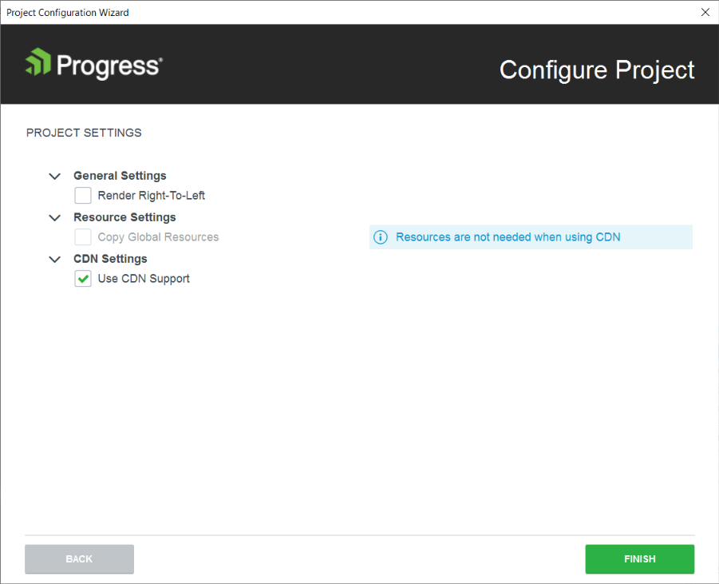

# Configuring Projects

This article demonstrates how to configure an existing {{ site.product }} application by using the **Project Configuration Wizard**. It is a {{ site.product }} VS extension that helps you to modify the appearance and the project settings of your {{ site.product }} application. 

To open the **Project Configuration Wizard**, click **Extensions** > **Telerik** > **Telerik UI for ASP.NET Core** > **Configure Project**

The configuration wizard consists of the following steps:  
- [Theme selection](#theme-selection)
- [Project settings](#project-settings)

## Theme Selection

The **Theme Selection** page enables you to change the [visual theme](https://docs.telerik.com/kendo-ui/styles-and-layout/appearance-styling#getting-started) of your {{ site.product }} application.

After selecting the desired theme, click **Next** to navigate to the [Project settings](#project-settings) page.

## Project Settings

The **Project Settings** page allows you to modify the project settings by configuring the following options:

- **Render Right-To-Left**&mdash;Updates the master page with the right-to-left (RTL) support class and adds a CSS reference for RTL styles.
- **Copy Global Resources**&mdash;Copies the localization files to `~/Scripts/kendo/{version}/cultures`.
- **Use CDN Support**&mdash;Enables or disables the [Kendo UI CDN support](https://docs.telerik.com/kendo-ui/intro/installation/cdn-service).

## See Also

* [Integrating Visual Studio in Your .Net Project]()
* [Downloading the Latest {{ site.product }} Versions]()
