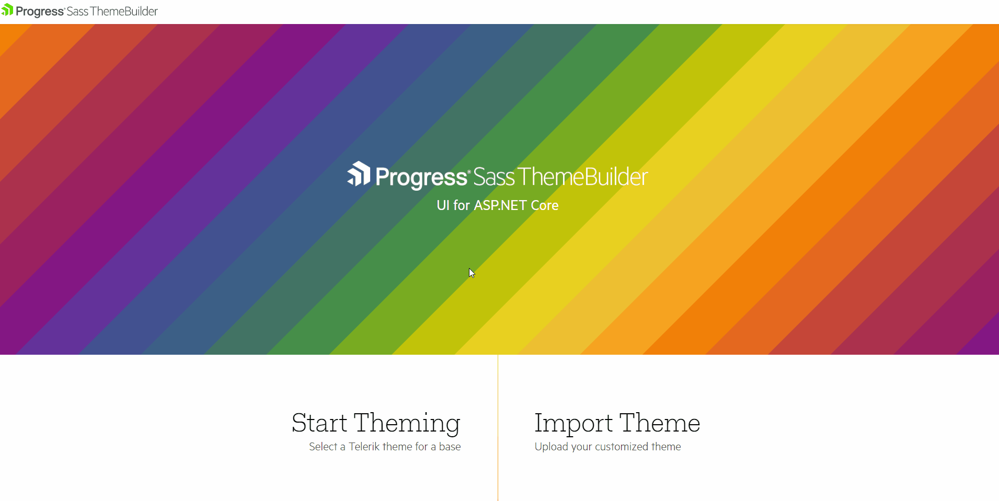
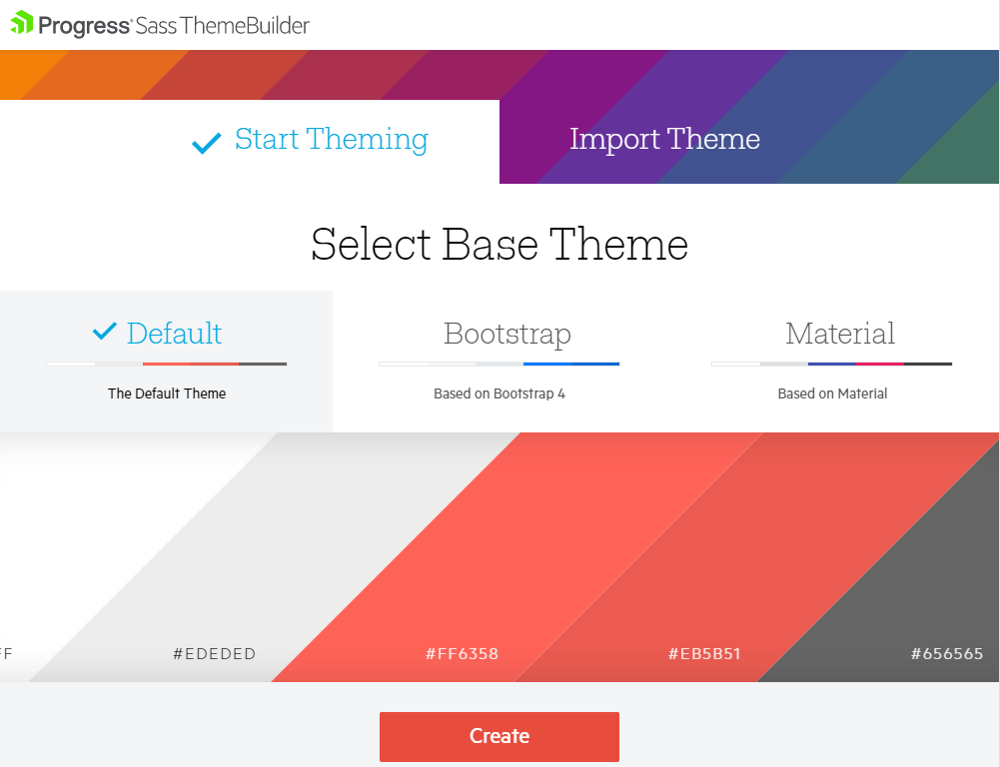
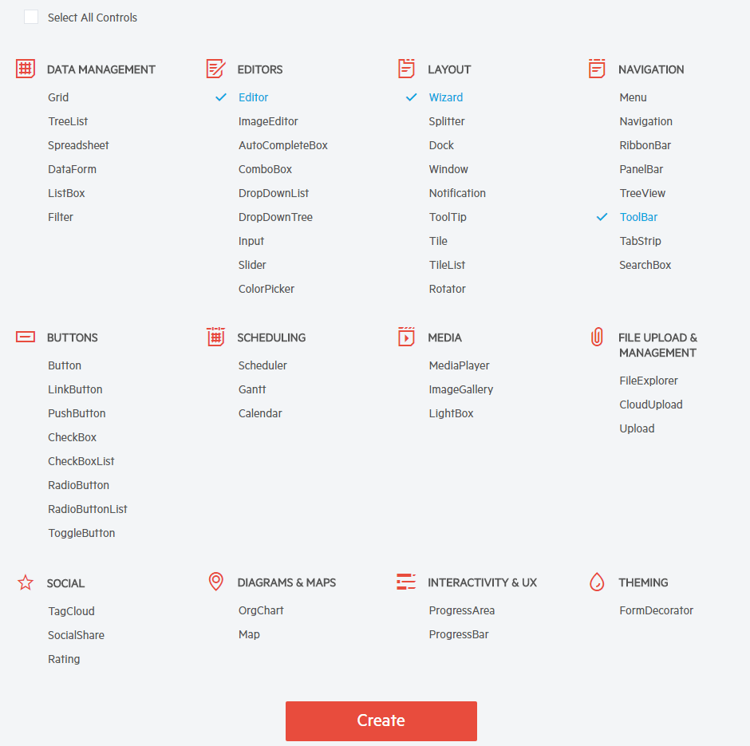
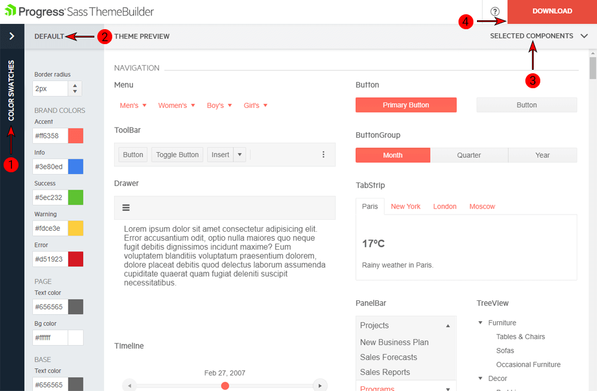

# Using the Sass Theme Builder

[**Progress Sass Theme Builder**](https://themebuilder.telerik.com/{{ site.platform }}) for {{ site.product_short }} is an Angular web application that enables you to create new or customize existing themes.

The tool renders the same look and feel as the look and feel of all other components in the suite. It also delivers full control over the skin elements of each component and automatically updates its composite units. After you create the skin and achieve the desired look of the theme, the Sass Theme Builder enables you to download and integrate it in your project.

Bootstrap 5 compatibility was added to the SASS themes in the R3 2021 release. As of R3 2021, you can choose from different predefined swatches of the SASS themes:

* Default theme swatches: Main, Main Dark, Nordic, Purple, Turquoise. 
* Bootstrap theme swatches: Main, Main Dark, Nordic, Urban, Vintage. 
* Material theme swatches: Main, Arctic, Fuscia, Lime Dark, Main Dark. 
* Classic theme swatches: Main, Opal, Silver.

If you are using Bootstrap 4, we recommend using the Bootstrap-v4 swatch of the Bootstrap theme.

**Figure 1: A preview of the Sass Theme Builder**


## Using Newly Created Themes

To create a new theme:

1. On the initial Sass Theme Builder pane, select the **Start Theming** option.
1. Choose one of the existing themes to serve as a starting point.
1. Select the components which you intend to style. You can also change the selection at a later stage.

    **Figure 2: Selecting a base theme and components**

    

Complex {{ site.product }} components, such as the Grid, rely on other components to deliver their full set of features. If you select the Grid, then all of its components dependencies styles (Button, AutoComplete, DropDownList, DatePicker, etc.) will also be included in the final bundle. The Theme Builder automatically updates the styling on all required components so that you do not need to customize each of them separately.

## Creating New Themes

To create a new theme:

1. On the initial Sass Theme Builder pane, select the **Start Theming** option.
1. Choose one of the existing skins to use as a base. The currently available built-in skins are **Default**, **Bootsrap**, and **Material**.

    

1. Scroll down and select the components you want to customize.

    

1. (Optional) After the initial selection, add or remove elements for customization.

To deliver the full set of their functionalities, some {{ site.product }} components, such as the Grid, have composite structures and include child components. In such cases, the Theme Builder automatically applies the theme modification to the child components and you do not need to customize each of them separately. It will also include their styles in the final CSS bundle.



## Modifying Themes

The Sass Theme Builder supports the following options for customization:

* Color pickers which customize the appearance of the components.
* The **Apply changes instantly** option which enables you to observe the changes on the fly.
* Manual updates of each component element.
* Utilization of predefined color swatches.

To customize an existing theme, use the following Sass Theme Builder features:

1. Color swatches&mdash;Contains predefined color palettes that you can apply to all components in your application.
1. Default&mdash;Provides the applicable color customization options.
1. Selected Components&mdash;List of components to include in the preview and the final CSS bundle.
1. Download&mdash;Downloads the archive that holds the generated style files after the customization completes. When you click the button, a dialog appears and prompts you to name your theme. The archive contains a css, scss and a json file. The json file contains information on the modified variables of the customized theme.

**Figure 3: Available options for customization**

To upload an existing theme you have previously created:

1. On the initial Sass Theme Builder pane, select **Import Theme**.
1. Upload the `MyThemeName.json` file which contains information on the modified variables of the customized theme. As a result, the selected components and styling elements load.
1. Start customizing your theme.

> Previous version of the Sass Theme Builder required the upload of the `variables.scss` file which contains the modifications of the customized theme. If you need to customize a theme generated with a previous version of the Sass Theme Builder, you can:

> * Download a theme from the new version,
> * Update the generated json with the variable values from your scss file and 
> * Upload the json to the Sass Theme Builder to continue customization.

**Figure 4: Importing themes for customization**


When you complete the modifications and the theme is ready to be used:

1. Download the theme as a compact archive by clicking the **Download** button.
1. Copy the downloaded `THEME_NAME.css` file and paste it in the **wwwroot** folder of your application.
1. Include the `THEME_NAME.css` file to the [client side resources](https://docs.telerik.com/aspnet-core/getting-started/installation/getting-started-copy-client-resources).

> Reference only the `THEME_NAME.css` file because the exported CSS file contains all styles you need.


## Adding the Themes to Your Project

When you complete the modifications and the theme is ready to be used:

1. Download the theme as a compact archive by clicking the **Download** button.
1. Copy the downloaded `THEME_NAME.css` file and paste it in the **Content** folder of your application.
1. Bundle the styles to render them or directly reference the styles in `Layout.cshtml`. For more information on CSS bundling in Telerik UI for ASP.NET MVC applications, refer to the article on [CSS bundling fundamentals](#css-bundling).

> Reference or bundle only the `THEME_NAME.css` file because the exported CSS file contains all styles you need.



## See Also

* [Cards]()
