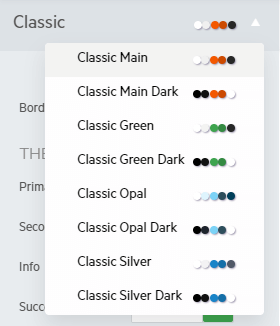

# LESS to SASS Theme Migration

In this article you will learn how to migrate your project from a LESS theme to its SASS counterpart. To find out if you are using a LESS theme, check the LESS section of the [Components Rendering Overview](#how-do-i-know-if-i-am-using-a-less-theme) article.

For additional information about the SASS themes, visit the [SASS-Based Themes]() article.

## Why Do I Need to Migrate to a SASS Theme?

> The LESS-based themes support only the default values of the new [Components Styling Options](#styling-options).

The LESS-Based themes will receive the new [styling options](#styling-options) just like the SASS themes, however after 2022 the LESS themes will be officially deprecated. Customers who continue to use LESS themes after their deprecation will not be able to take advantage of the newest visual updates, features and bug fixes. This also means that Kendo UI versions starting from 2023 will be incompatible with the LESS themes and you won't be able to upgrade the version of the product.

The reason behind the deprecation of the LESS-Based themes is that they take a tremendous amount of time and resources to be kept updated.

The SASS-based themes provide several unique swatches that are based on the main theme and can be updated at once. This allows us to change the design and color scheme of our components in a more timely manner which in turn leaves more time for new themes and swatches to be developed.

With the LESS-based themes, each individual theme has its own code base. Any time a component is updated or introduced, we must recreate each LESS theme to ensure that the new addition is rendered without problems.

Ultimately, the goal behind these changes is to allow us to free resources which will be used to update existing themes and also create new themes that have been requested by our clients.

## How Do I Migrate to a SASS Theme?

The migration to a SASS theme is a very straightforward process:

1. Remove the old LESS theme references, for example:

   ```html
        <!-- The following styles are required for the LESS Classic theme. -->
        <link rel="stylesheet" href="https://kendo.cdn.telerik.com/2021.3.1207/styles/kendo.common.min.css" />
        <link rel="stylesheet" href="https://kendo.cdn.telerik.com/2021.3.1207/styles/kendo.default.min.css" />
        <link rel="stylesheet" href="https://kendo.cdn.telerik.com/2021.3.1207/styles/kendo.default.mobile.min.css" />
   ```

1. Add a reference to the SASS theme that you want to use, for example:

   ```html
        <!-- The following styles are required for the SASS Classic theme. -->
        <link rel="stylesheet" href="https://kendo.cdn.telerik.com/2021.3.1207/styles/kendo.classic-main.min.css" />
   ```

With the new rendering of the components, some CSS classes will be deleted. If you use any of those classes to customize a component, you will have to update their references. Otherwise the customizations will be lost. For additional information, check the [CSS Classes Migration](#css-classes-migration) section of the [Components Rendering Overview]() article.

## How Do I Know Which SASS Theme Corresponds to My Current LESS Theme?

The LESS themes have SASS swatches which are under the `Classic` theme.



The following table contains the name of the LESS theme and its SASS counterpart:

| LESS Theme   | SASS Theme | Status | SASS Theme CDN
|:---         |:---        |:---        |:---
| `Default` | `Classic Theme - Main` | Available | https://kendo.cdn.telerik.com/2021.3.1207/styles/kendo.classic-main.min.css |
| `Blue Opal` | `Classic Theme - Opal` | Available | https://kendo.cdn.telerik.com/2021.3.1207/styles/kendo.classic-opal.min.css |
| `Silver` | `Classic Theme - Silver` | Available | https://kendo.cdn.telerik.com/2021.3.1207/styles/kendo.classic-silver.min.css |
| `Fiori` | `Classic Theme - Fiori` | In Progress | N/A |
| `Flat` | `Classic Theme - Flat` | In Progress | N/A |
| `High Contrast` | `Classic Theme - High Contrast` | In Progress | N/A |
| `Metro` | `Classic Theme - Metro` | In Progress | N/A |
| `Metro Black` | `Classic Theme - Metro Black` | In Progress | N/A |
| `Moonlight` | `Classic Theme - Moonlight` | In Progress | N/A |
| `Nova` | `Classic Theme - Nova` | In Progress | N/A |
| `Office 365` | `Classic Theme - Office 365` | In Progress | N/A |
| `Uniform` | `Classic Theme - Uniform` | In Progress | N/A |

> The Bootstrap and Material LESS themes will not have their own SASS swatches. The dedicated Bootstrap and Material SASS themes should be used instead.

The following example demonstrates how to add a theme to your project:

```html
<link rel="stylesheet" href="https://kendo.cdn.telerik.com/2021.3.1207/styles/kendo.classic-main.min.css" /> 
```

The above snippet must be added to the `head` element of the page.

## Which Styling Options Are Available For the LESS Themes?

The LESS-based themes support only the default values of the new [Components Styling Options](#styling-options). If you wish to utilize the full potential of the new rendering of the components, you must use a SASS-based theme or swatch.

## See More

* [Styling Overview Article]()
* [SASS-Based Themes Article]()
